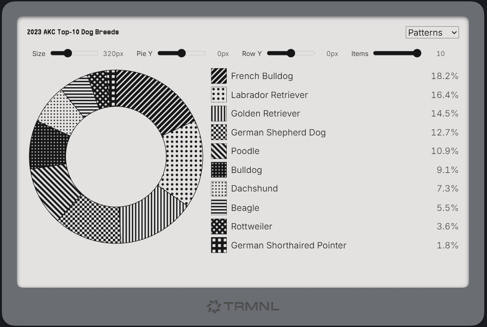

# TRMNL Pie POC — Patterns & Grayscale

A zero-dependency, drop-in pie chart for TRMNL and the web.  
Supports **10 distinct SVG hatch patterns** and **10 grayscale shades**, live “knobs” for layout, and **in-source data attributes** for touchscreen-free devices like TRMNL.




## Features
- 10 unmistakable hatch patterns + 10 grayscale fills
- Pattern strokes scale with the chart so hatches stay crisp at any size
- Legend swatches use scale-matched patterns that exactly mirror the pie
- Web “knobs” (sliders) for fast tweaking in a browser
- In-source `data-*` knobs for TRMNL (no touch required)
- Fully self-contained HTML block; no external JS/CSS

## Quick start
Create an `index.html` and paste the block from this repo’s `index.html` into the `<body>`.  
Open the file locally in a browser to test the knobs. On TRMNL, set defaults with `data-*` attributes.

## Drop-in usage
The component is a single `<div class="ns-pie10" …>` block containing its own `<style>`, `<svg>`, and `<script>`.  
It can be embedded into other markups without name collisions.

Minimal example:

```html
<div class="ns-pie10"
     data-title="US Dog Breeds (Top 10)"
     data-mode="patterns"
     data-thickness="42"
     data-size="320"
     data-count="10"
     data-piey="0"
     data-rowoffset="0"
     data-patscale="140"
     data-swatch="28"
     data-legend-min="180">
  <!-- component styles, svg, controls, and script live here -->
  <script type="application/json" class="data">
  {
    "items": [
      { "name": "French Bulldog",               "value": 18.2 },
      { "name": "Labrador Retriever",           "value": 16.4 },
      { "name": "Golden Retriever",             "value": 14.5 },
      { "name": "German Shepherd Dog",          "value": 12.7 },
      { "name": "Poodle",                       "value": 10.9 },
      { "name": "Bulldog",                      "value": 9.1 },
      { "name": "Dachshund",                    "value": 7.3 },
      { "name": "Beagle",                       "value": 5.5 },
      { "name": "Rottweiler",                   "value": 3.6 },
      { "name": "German Shorthaired Pointer",   "value": 1.8 }
    ],
    "unit": "%"
  }
  </script>
</div>
```

## Data format
Provide up to 10 items in inline JSON:

```json
{
  "items": [
    { "name": "Label A", "value": 12.3 },
    { "name": "Label B", "value": 7.7 }
  ],
  "unit": "%"
}
```

- `value` is any positive number; the chart normalizes to 100%.
- `unit` is appended in the legend (optional).

## Knobs (in-source `data-*`)
Set defaults for TRMNL or other non-interactive environments.

| Attribute          | Type / Range              | Default | What it does |
|---|---|---:|---|
| `data-title`       | string                    | —       | Title shown in header. |
| `data-mode`        | `patterns` \| `grayscale` | patterns| Choose hatch patterns or grayscale. |
| `data-size`        | px (suggest 120–720)      | 320     | Pie diameter in pixels. |
| `data-thickness`   | 1–95                      | 42      | Donut thickness (% of radius). |
| `data-count`       | 1–10                      | 10      | Number of items shown (pie + legend). |
| `data-piey`        | px                        | 0       | Nudge pie up/down inside the SVG. |
| `data-rowoffset`   | px                        | 0       | Move the entire pie+legend row vertically. |
| `data-patscale`    | 60–200                    | 140     | Global hatch density (higher = tighter). |
| `data-swatch`      | px                        | 28      | Size of legend pattern boxes. |
| `data-legend-min`  | px                        | 180     | Minimum legend column width. Lower this to let the pie grow wider. |

## Web preview controls
When viewed in a browser, you’ll see:
- **Palette** selector (top-right)
- Single row of sliders: **Size**, **Pie Y**, **Row Y**, **Items**

These mirror the `data-*` knobs so you can discover good defaults, then bake them into markup for TRMNL.

## Layout tips (TRMNL/e-ink)
- On smaller canvases, reduce `data-legend-min` (e.g., 150) so the pie can honor a larger `data-size`.
- For 1-bit displays, prefer `data-mode="patterns"`.
- If two wedges feel close on e-ink, raise `data-patscale` (150–165) or increase `data-swatch` to 30–32.

## Pattern set
Exactly 10 visually distinct fills (lines, dots, grids, checker, diamond).  
Legend swatches are rendered with a **scale-matched pattern set**, ensuring the key always matches the pie.

## Accessibility
- The pie is decorative (`aria-hidden="true"`).  
- Provide the same information in the legend for screen readers.

## Files
- `index.html` — self-contained component (copy this block into other markups as needed)  
- `docs/screenshot.png` — optional image for the README

## License
MIT

## Credits
- Built for the TRMNL ecosystem by Bryan Dort + ChatGPT.  
- Breed order based on AKC Top-10 (values normalized for demo purposes).
